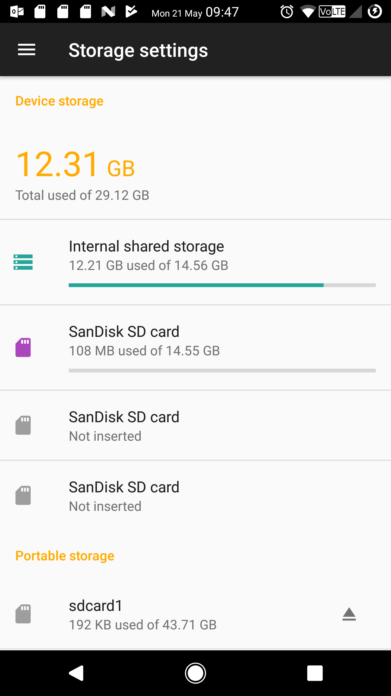

# motoxp

## WARNING:
I'll say this LOUD and CLEAR: take a **full backup** of the data currently stored for your SD card, as all the *information will be **destroyed*** as result of repartitioning activities


## Mixed storage for my (lovely) Moto X Pure

Running out of space with my internal memory? No problem, there is a 64gb sdxc that can help... But, I didn't want to have it fully assigned for internal storage

```
D:\Android\platform-tools>adb devices -l
List of devices attached
* daemon not running. starting it now on port 5037 *
* daemon started successfully *
TA084033JR             device product:Moto X Pure Edition model:XT1575 device:clark


D:\Android\platform-tools>adb shell sm list-disks adoptable
disk:179_64

D:\Android\platform-tools>adb shell sm list-volumes all
private mounted null
public:179_65 mounted A511-110B
emulated mounted null

D:\Android\platform-tools>adb shell sm partition disk:179_64 mixed 75

D:\Android\platform-tools>adb shell sm list-volumes all
private:179_67 mounted fe4b63d4-0240-4979-9968-88d70e534da0
private mounted null
public:179_65 mounted BC9C-110B
emulated mounted null
emulated:179_67 unmounted null

D:\Android\platform-tools>adb shell sm format private:179_67

D:\Android\platform-tools>adb shell sm mount private:179_67

D:\Android\platform-tools>adb shell sm list-volumes all
private:179_67 mounted 58806806-588b-4eb3-b8f5-9c099aa54b5b
private mounted null
public:179_65 mounted BC9C-110B
emulated mounted null
emulated:179_67 unmounted null

D:\Android\platform-tools>adb shell sm list-disks adoptable
disk:179_64
```

### Results...

* +14gb of additional storage coming from external memory and assigned for Android usage
* I basically doubled original phone's storage, to ~30gb, and now my apps can keep (constantly) updating without impacting my activities
* still a lot of shared/public in my sd card to carry with me all my stuff (roms, music, backups, photos, documents, etc.)




[inspiration source](https://android.stackexchange.com/questions/145457/i-want-to-split-one-microsd-card-into-two-parts-part-adoptable-storage-and-par)
